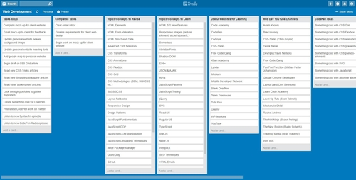

# Trello Board Layout
This project demonstrates how CSS Grid (with flexbox fallback) can be used to re-create the layout of a Trello board.

## Live Demo
A live demo is available on [CodePen](https://codepen.io/GeorgePark/full/bLLzJK/).

******Note  about licensing. As this same project was published in public Codepen, (https://codepen.io/GeorgePark/pen/bLLzJK) I assume same model applies, but last word belongs to the author.
